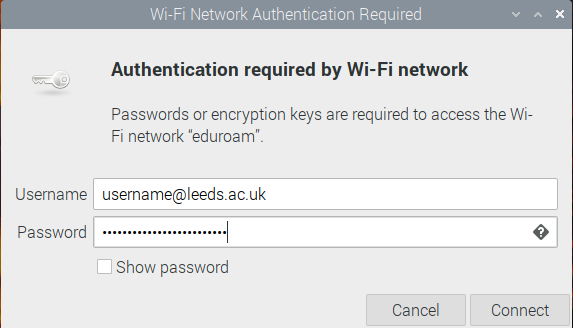

# How to connect to eduroam

Most of the instructions were found in [this IT knowledge base article, method 2.](https://it.leeds.ac.uk/it?id=kb_article&sysparm_article=KB0012058)  I have copied them here to save looking them up and added extra notes.

Tested with:

* Raspberry Pi OS with desktop and recommended software (32 bit), Debian Bullseye, 4 April 2022.
* Raspberry Pi OS with desktop (64 bit), Debian Bullseye, 4 April 2022.

## Install NetworkManager

1. You need to install network manager first.  To do this, connect the Raspberry Pi to your phone Wi-Fi hot spot or tether to your phone using a USB cable and, once connected, run the following commands:

    ```bash
    sudo apt update
    sudo apt install network-manager network-manager-gnome openvpn openvpn-systemd-resolved network-manager-openvpn network-manager-openvpn-gnome
    sudo apt purge openresolv dhcpcd5
    sudo ln -sf /lib/systemd/resolv.conf /etc/resolv.conf
    ```

    __DO NOT DO A FULL UPGRADE USING YOUR PHONE.__ The full update can be done once you are on Eduroam, saving lots of your precious data!

    For your convenience, the script `eduroam.bash` does all this for you, so you can clone this repo and then run the script as follows:

    ```bash
    cd ~
    git clone https://github.com/RealRobotics/rpi-kb
    cd rpi-kb/eduroam
    ./eduroam.bash
    ```

2. Reboot (`sudo reboot` works well).
3. The network manager icon should now be shown at the top of the screen.  Select Eduroam and try to connect.  A dialog box should be shown where you can enter the info as shown below:

    

    Replace `username` with your username and `xxxxxxxx` with your password.  Press `OK` and then try connecting to Eduroam.  If all goes well, you should be able to connect.
4. Finally for this section, remove the old network applet as follows.  
   1. Right click menu bar on top of screen -> open "Panel Settings" -> "Panel Applets": remove "Wireless & Wired Network".
   2. To keep things tidy, you also need to remove the spacer.  Right click on the space where the network icon used to be and select 'Remove "Spacer"'.

## Forcing password entry

As the password that you have just entered is held in a plain text file, it is much more secure to force the user to enter their password every time they connect to the network.

1. Ensure that you are disconnected from Eduroam.
2. Edit the system connection file `/etc/NetworkManager/system-connections/eduroam` using `sudo nano` or an editor of your choice.
3. Find section `[802-1x]` and change the line `password=XXXXXXXXXX` to   `password-flags=2`.
4. Save and exit the editor.
5. Reboot.
6. Try to connect to Eduroam.
7. You should now be prompted to enter your password.

    

    If you are not prompted and just have a dialog box "Connect" and "Cancel" button, use `nmtui` instead, to enter your username and password. See below for details.

### Example system connection file

[This is what a working system connection file looks like.](working_files/eduroam)

### Changing the username

It is possible to change the username but it is not as easy as typing the new username in the password entry dialog box.  If you try that, only the password that you have entered is used with the username from the system connection file and it will fail.  To do this properly, you need to do this:

1. Open the system connection file in your editor as described above.
2. Find the line `identity=username@leeds.ac.uk` and change `username` to `newusername`.
3. Save, exit editor and reboot.

When you next try to connect to Eduroam, you will be shown the new username and the new username will be used.

## Using `nmtui`

The `nmtui` utility is an ncurses implementation of the Network Manager application and because it can be invoked with `sudo`, it works when the full Network Manager application doesn't behave.

The following shows you how to enter your `eduroam` user name and password.

1. In a terminal window, enter `sudo nmtui`.
2. Use the arrow keys to select "Activate a connection" and press enter.
3. Select `eduroam` and press enter.
4. You should now be prompted to enter your username and password.  Do this and press enter.  After a few seconds, you should be connected.

